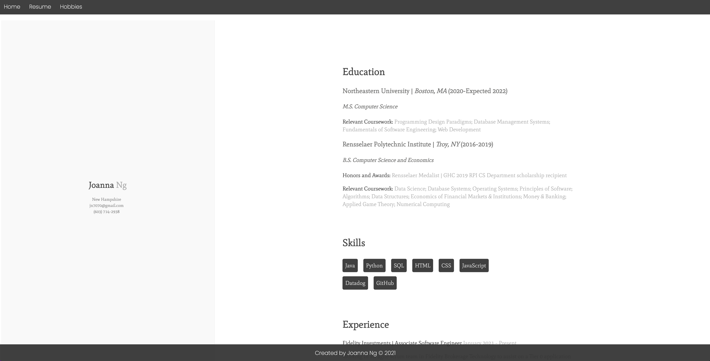
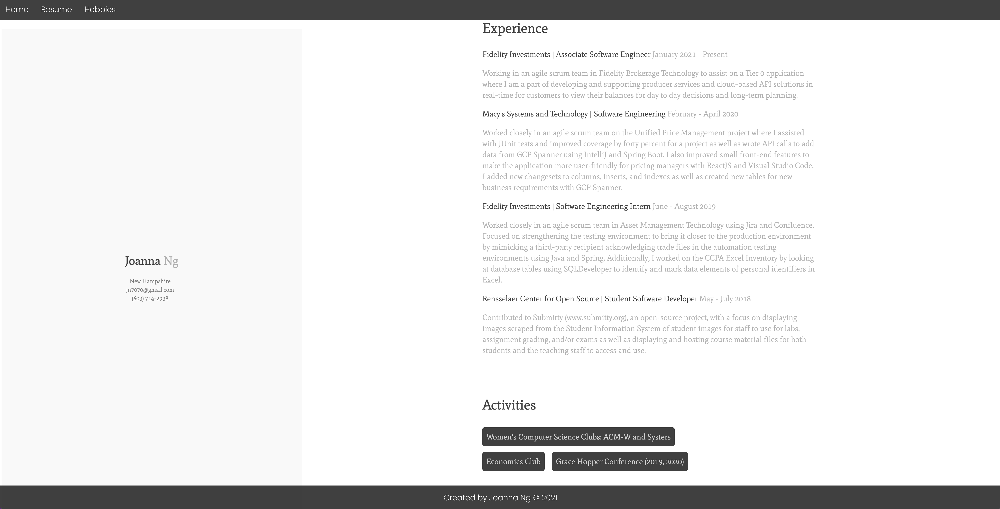
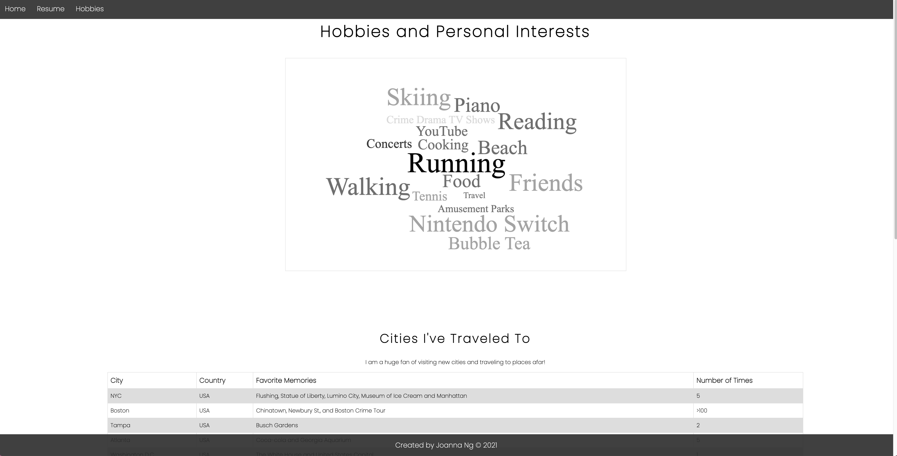
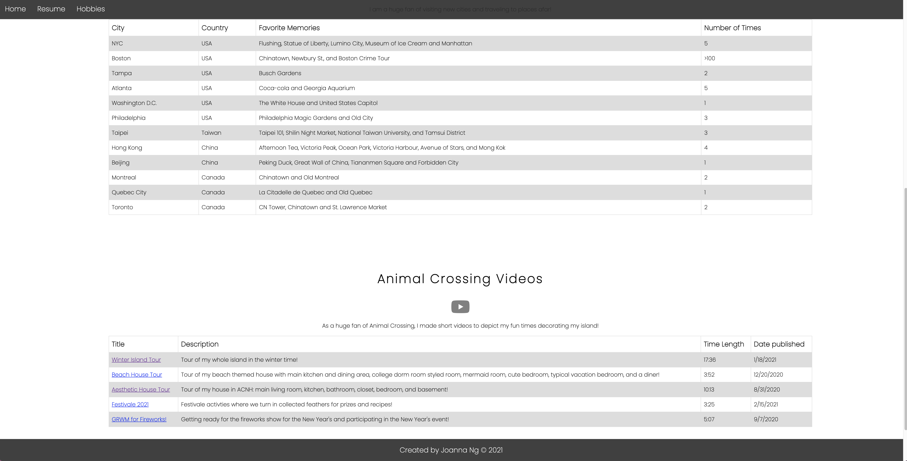

# PersonalWebsite-JoannaNg

## Link to the Live Website on Heroku
[Heroku Website Link](https://joannang-website.herokuapp.com/)
## Description of Website
This is my personal website where there is a landing page with a brief intro of myself and links to socials. There are two other internal
links that lead to a resume page and a hobbies page. The resume page contains my education, skills, experience, and activities. The hobbies page
contains my personal interests in my free time as well as my favorite cities I've traveled to and fun facts and my Animal Crossing videos I created for YouTube. 

## Screenshots of Website

## Fulfillment of Bulleted Requirements for the Personal Website
There is a landing page that explains what the site is about. There is a header bar as a navigational element. There are two internal links: resume and hobbies pages. There are many external links embedded in my website. There are three on the landing page using the icons for my socials. There are links to each individual video for my Animal Crossing Videos section of the Hobbies page under Title and a link to my YouTube channel using the YouTube icon and all will open directly in another tab. There are two HTML tables with CSS styling in the Hobbies page. One is for the Cities I have Traveled To and the other is for my Animal Crossing Videos. The tables have interactive highlighting where when the mouse enters the row, it will highlight the entire row in a blue color. There is also a hovering effect for when the mouse hovers over the YouTube icon in the Hobbies page where it will turn red. 
Lastly, there is also responsiveness based on whether the site is on a desktop browser or on a mobile device.  

## Image Credit link
https://wallpaper.dog/aesthetic-white-desktop-wallpapers